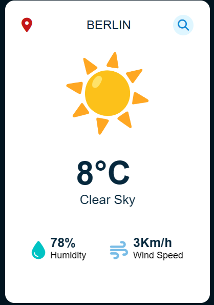
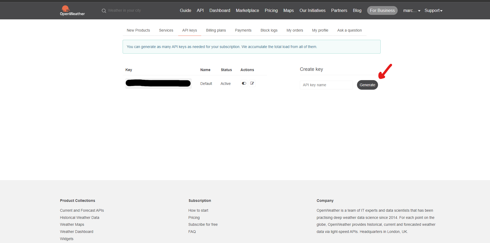

# ⛅ Weather web application ⛅

## 📑 Description

This is a simple weather web application that uses the OpenWeatherMap API to get the weather data for a given city. 

The propose of this project is to learn how to use 
APIs and how to handle the data that they return.

Here is a screenshot of the application:

<div align="center">



</div>

##

- ## First steps
  
    - ### Weather API key
  
    To have the Weather API you need to go to [OpenWeatherMap](https://openweathermap.org/) and create an account.

    Once you have your account you need to go to the API keys section and create a new key.

    

    Once you have your key, you probably will have to wait a few minutes for it to be activated. After that you can start using it and integrate it in your project.

    - ### Basic structure
      - ### HTML
        
        Begin creating a basic layout of the page similar to the one in the screenshot. You can use the one that it is in the repository.
         
      - ### CSS
        
        The CSS is also very simple, you can build by yourself or you can use the one that it is in the repository.

      - ### JavaScript

        The JavaScript file is where all the magic happens. You can find the file in the repository. But let's go through the code to see how it works.
        
        **First we need to get the elements that we are going to use in the HTML file.**

        In my case I used utility functions to get the elements, but you can use the method that you prefer.

        ```javascript
        /** Utility functions **/
        
        function onEvent(event, selector, callback) {
            if (!event || !selector || !callback) {
              throw new Error("Missing required arguments");
            }
            return selector.addEventListener(event, callback);
        }

        function select(selector, parent = document) {
              if (!selector) {
                throw new Error("Missing required argument");
              }
              return parent.querySelector(selector);
        }

        ```

        You can add some functions to help and make your code more readable.

        ```javascript

        function notFound() {
          container.style.height = '400px';
          weatherBox.style.display = 'none';
          weatherDetails.style.display = 'none';
          error404.style.display = 'block';
          error404.classList.add('fadeIn');
        }
        
        function updateWeatherData(json) {
          temperature.textContent = `${parseInt(json.main.temp)}°C`;
          description.textContent = `${json.weather[0].description}`;
          humidity.textContent = `${json.main.humidity}%`;
          wind.textContent = `${parseInt(json.wind.speed)}Km/h`;
          weatherBox.style.display = '';
          weatherDetails.style.display = '';
          weatherBox.classList.add('fadeIn');
          weatherDetails.classList.add('fadeIn');
          container.style.height = '590px';
          }
        ```
        
  
  ## **Now we need to create the function that will get the data from the API.**

       
  This code snippet bellow defines an asynchronous function named searchWeather that performs a weather search based on the value entered in a search box on a webpage. It retrieves the value from the search box, constructs a URL with the city name and an API key, and makes a request to the OpenWeatherMap API to fetch the weather data for that city. If the response is successful, it updates the webpage with the weather information and displays an appropriate weather image based on the weather condition. If the response is not successful, it calls a function named notFound. Any errors that occur during the process are caught and logged to the console
  ```javascript
  async function searchWeather() {
    // A constant variable named APIKey is declared and assigned a value
    const APIKey = 'Your API key';
    
    // The value of the input element with class 'search-box' is stored in the constant variable city
    const city = document.querySelector('.search-box input').value;
    
    // If the city value is an empty string, return from the function
    if (city === '') {
      return;
    }
    
    try {
      // Send a fetch request to the OpenWeatherMap API to get the weather data for the specified city
      const response = await fetch(`https://api.openweathermap.org/data/2.5/weather?q=${city}&units=metric&appid=${APIKey}`);
    
      // If the response status is not ok, call the notFound function and return from the function
      if (!response.ok) {
        notFound();
        return;
      }
      
      // Parse the response body as JSON and store it in the constant variable json
      const json = await response.json();

      // Hide the element with id 'error404' and remove the 'fadeIn' class from it
      error404.style.display = 'none';
      error404.classList.remove('fadeIn');
    
      // An object map named weatherImageMap is declared with weather conditions as keys and image paths as values
      const weatherImageMap = {
        'Clear': 'images/clear.png',
        'Rain': 'images/rain.png',
        'Snow': 'images/snow.png',
        'Clouds': 'images/cloud.png',
        'Haze': 'images/mist.png',
        'Mist': 'images/mist.png',
      };
    
      // Get the weather condition from the first element of the 'weather' array in the JSON response
      const weatherCondition = json.weather[0].main;
      
      // Set the src attribute of the 'image' element to the corresponding image path from the weatherImageMap, or an empty string if not found
      image.src = weatherImageMap[weatherCondition] || '';
      
      // Call the updateWeatherData function and pass the json object as an argument
      updateWeatherData(json);
      
      // Print a debugging message to the console
      console.log('searchWeather function called'); // Debugging line
    } catch (error) {
      // If an error occurs, log the error to the console
      console.error(error);
    }
  }
  ```
  The **console logs** are totally optional, but they can help you to debug your code.
  
  In this case we are using the async/await syntax, but you can use the .then() syntax if you prefer.

  The **_API KEY_** is added to the URL as a **query parameter**. The API key is used to authenticate the request and to track API requests associated with your project for billing purposes. You can find your **_API KEY_** in the **API KEYS** section of your account page.

  All API have **limits**, so you need to be careful with the number of requests that you make. You can see recommendations for the OpenWeatherMap API [here](https://openweathermap.org/appid#use).

  After that you need to add an event listener to the search button to call the searchWeather function when the button is clicked.

  ```javascript
  onEvent('click', search, searchWeather);
  ```
  And that's it, you have your weather web application working.

  You can improve the application by adding more features and styling it in your own way.

## Demo

<div align= "center" >

<video src="20231108-2035-31.9275617.mp4" controls title="Title"></video>

</div>

You can see a demo of the application [here](https://marcelolop.github.io/weather_app/).

## References

- [OpenWeatherMap](https://openweathermap.org/)
- [Fetch API](https://developer.mozilla.org/en-US/docs/Web/API/Fetch_API)
- [AsmrProg-YT - Weather app tutotrial ](https://github.com/AsmrProg-YT/100-days-of-javascript/tree/master/Day%20%2310%20-%20Weather%20App)
